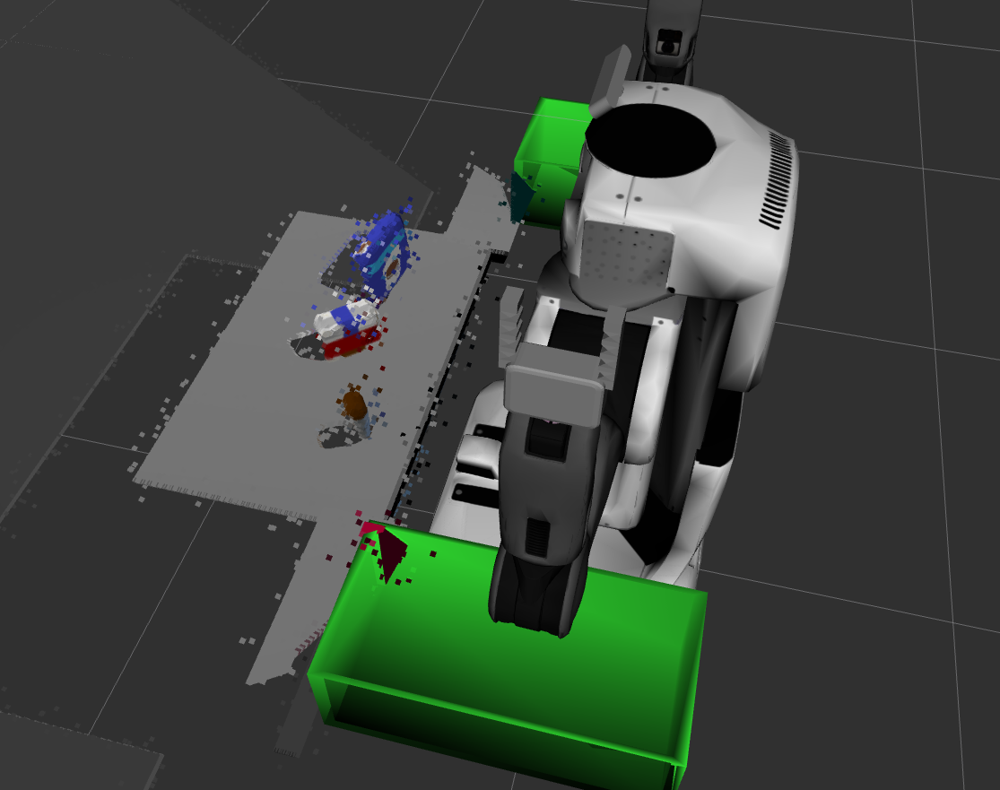
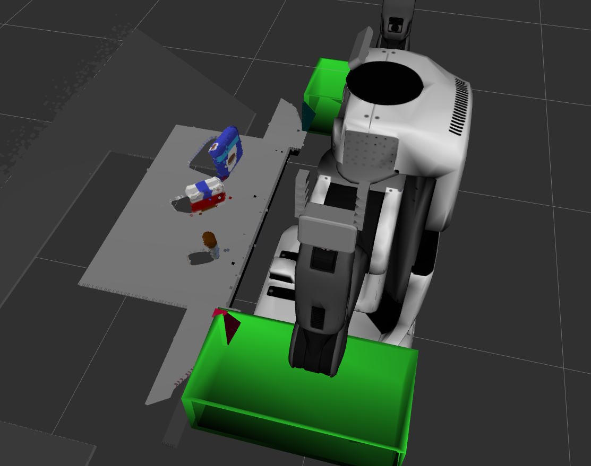
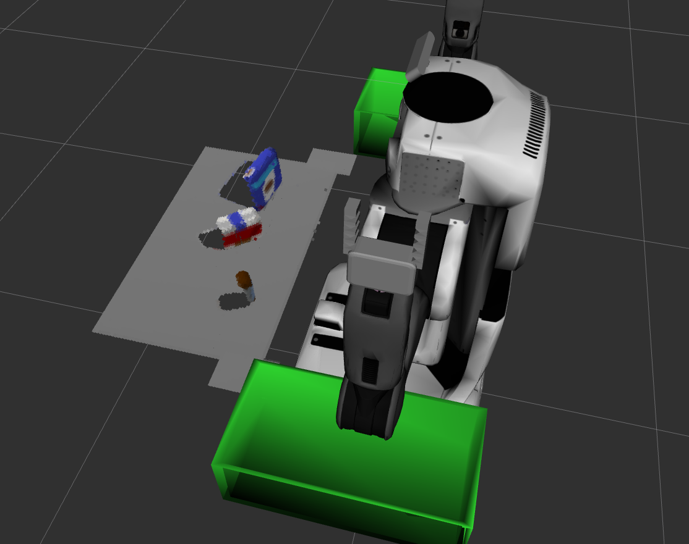
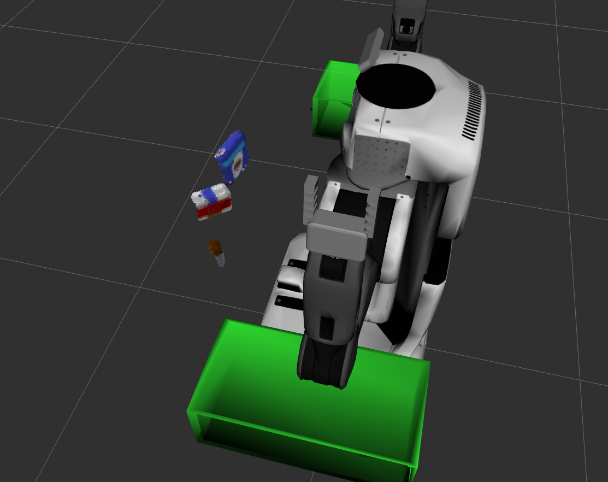
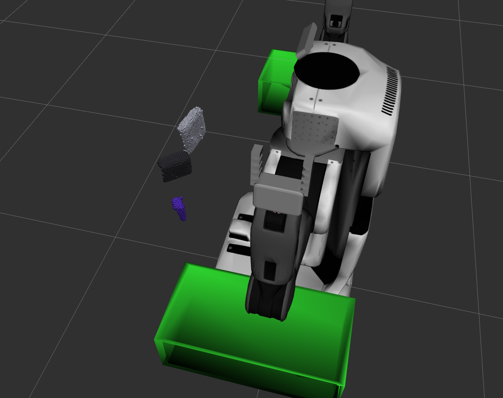
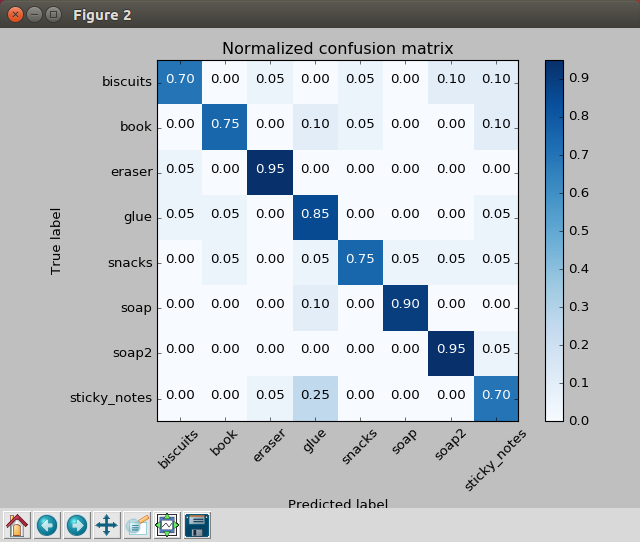
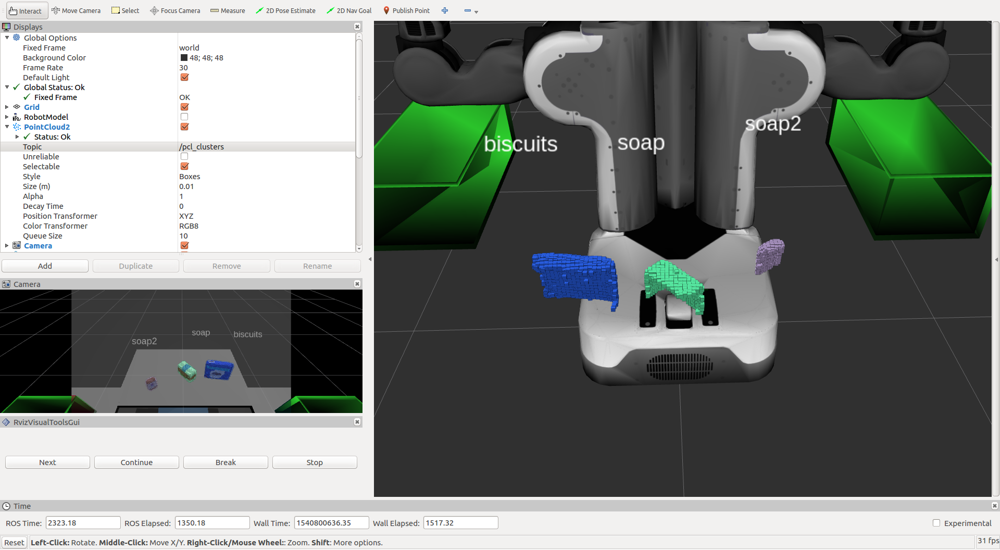
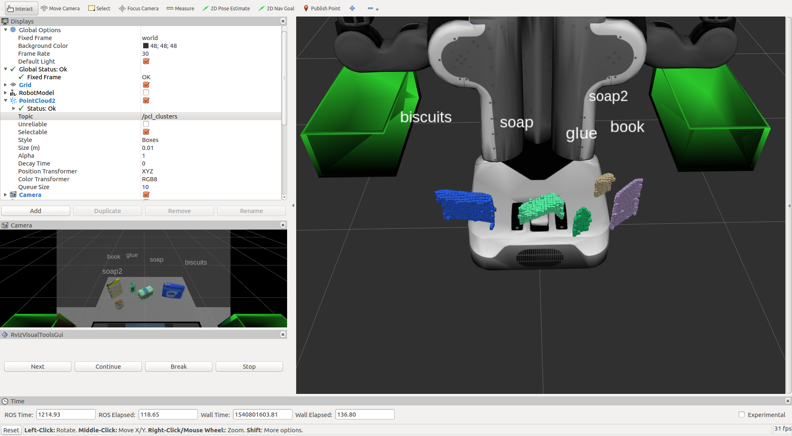
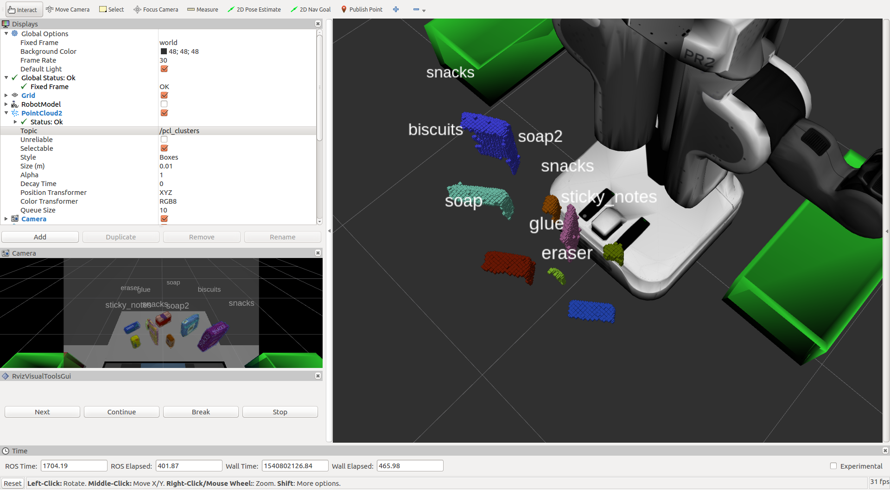

## Project: Perception Pick & Place

### Writeup / README

### Exercise 1, 2 and 3 pipeline implemented
#### 1. Complete Exercise 1 steps. Pipeline for filtering and RANSAC plane fitting implemented.

The first step was to apply a statistical outlier filter to the point cloud. The original point clod looked like so

After applying the statistical outlier filter the point cloud was reduced to this

Then, a down-sampling operation yielded

Finally, a pass-through filter eliminated points outside of the area of interest immediately infront of the robot

#### 2. Complete Exercise 2 steps: Pipeline including clustering for segmentation implemented.  

The clustering and segmentation steps first isolated the objects from the table

And then grouped the points belonging to each object based on geometry_msgs

#### 2. Complete Exercise 3 Steps.  Features extracted and SVM trained.  Object recognition implemented.

After fine-tunning SVM model, the following performance was achieved

### Pick and Place Setup

#### 1. For all three tabletop setups (`test*.world`), perform object recognition, then read in respective pick list (`pick_list_*.yaml`). Next construct the messages that would comprise a valid `PickPlace` request output them to `.yaml` format.

Applying the trained object recognition algorithm yielded good results. In world 1, 3/3 objects were correctly identified.

In world 2, 5/5 objects were correctly identified.

In world 3, 7/8 objects were correctly identified, with the book being identified as either snacks or sticky notes, which is probably attributable to the fact that it shares the shape characteristics of the snacks and the color characteristics of the sticky notes.

On occasion the glue was also misidentified as soap, but I suspect that has a lot to do with the fact that it was partially blocked by the book.

Spend some time at the end to discuss your code, what techniques you used, what worked and why, where the implementation might fail and how you might improve it if you were going to pursue this project further.  

The model was improved significantly by computing features for a larger set of random orientations, converting RGB data to HSV, and increasing the number of bins for the histograms. However, that is exactly part of the code that I would work on improving further. I believe that adding additional features might increase the algorithms effectiveness at distinguishing between objects that are similar in color or similar in shape to each other.
